# Project Diagrams - Sales CRM
## CRM Healthcare/Pharmaceutical Platform

**Versi**: 1.0  
**Last Updated**: 2025-01-15  
**Purpose**: Visualisasi scope, fitur, dan user flow untuk Developer 1, 2, dan 3

---

## 📋 Daftar Isi

1. [Project Scope Overview](#project-scope-overview)
2. [Feature Modules Diagram](#feature-modules-diagram)
3. [User Flow Diagrams](#user-flow-diagrams)
4. [Input/Output Diagrams](#inputoutput-diagrams)
5. [System Architecture Diagram](#system-architecture-diagram)

---

## Project Scope Overview

### Platform & Technology Stack

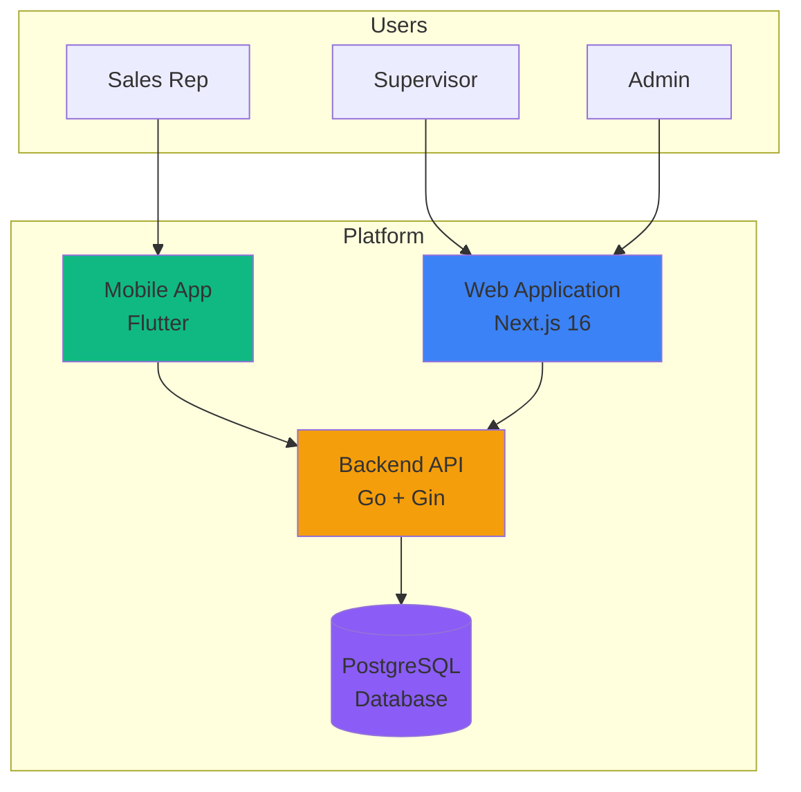

### Core Modules Overview

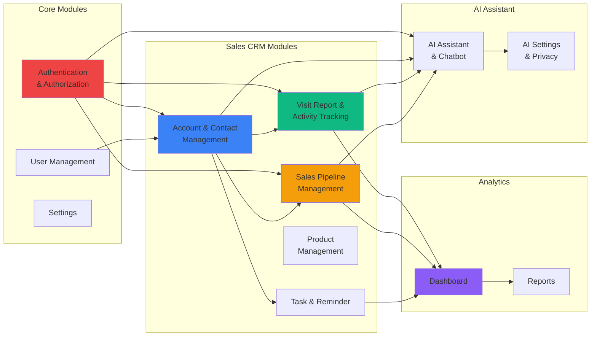

---

## Feature Modules Diagram

### Module Features & Capabilities

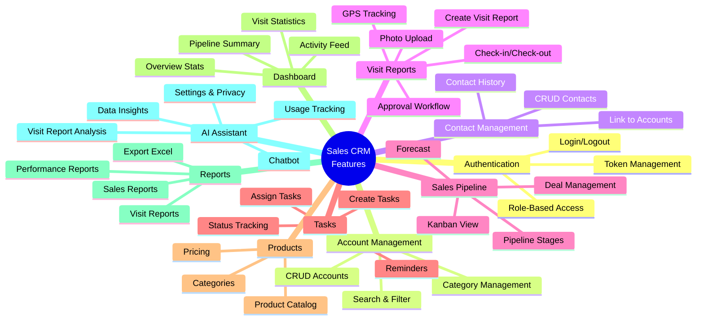

### Feature Matrix by Platform & Role

| Feature | Web (Admin) | Web (Supervisor) | Web (Sales Rep) | Mobile (Sales Rep) | Backend API |
|---------|------------|------------------|-----------------|-------------------|-------------|
| **Authentication** | ✅ Full | ✅ Full | ✅ Full | ✅ Full | ✅ Full |
| **User Management** | ✅ Full | ❌ | ❌ | ❌ | ✅ Full |
| **Account Management** | ✅ Full (CRUD) | ✅ Full (CRUD) | ✅ Full (CRUD) | ✅ View Only | ✅ Full |
| **Contact Management** | ✅ Full (CRUD) | ✅ Full (CRUD) | ✅ Full (CRUD) | ✅ View Only | ✅ Full |
| **Visit Reports** | ✅ Full (View All) | ✅ Review/Approve | ✅ Create/View Own | ✅ Create/View Own | ✅ Full |
| **Sales Pipeline** | ✅ Full | ✅ Full | ✅ Full (Own Deals) | ❌ | ✅ Full |
| **Tasks** | ✅ Full | ✅ Full (Assign) | ✅ Full (Own Tasks) | ✅ Full (Own Tasks) | ✅ Full |
| **Products** | ✅ Full | ✅ View Only | ✅ View Only | ✅ View Only | ✅ Full |
| **Dashboard** | ✅ Full (All Data) | ✅ Full (Team Data) | ✅ Full (Own Data) | ✅ Basic (Own Data) | ✅ Full |
| **Reports** | ✅ Full | ✅ Full (Team Reports) | ✅ View Own Reports | ❌ | ✅ Full |

**Note**: 
- Sales Rep dapat menggunakan **Web App** untuk semua fitur yang tersedia di Mobile, plus fitur tambahan seperti Sales Pipeline
- Mobile App fokus pada fitur yang dibutuhkan di lapangan (Visit Reports dengan GPS/Camera, Tasks, Dashboard basic)
- Web App memberikan akses lebih lengkap untuk Sales Rep, terutama untuk data entry dan review yang lebih nyaman

---

## User Flow Diagrams

### 1. Sales Rep User Flow (Web)

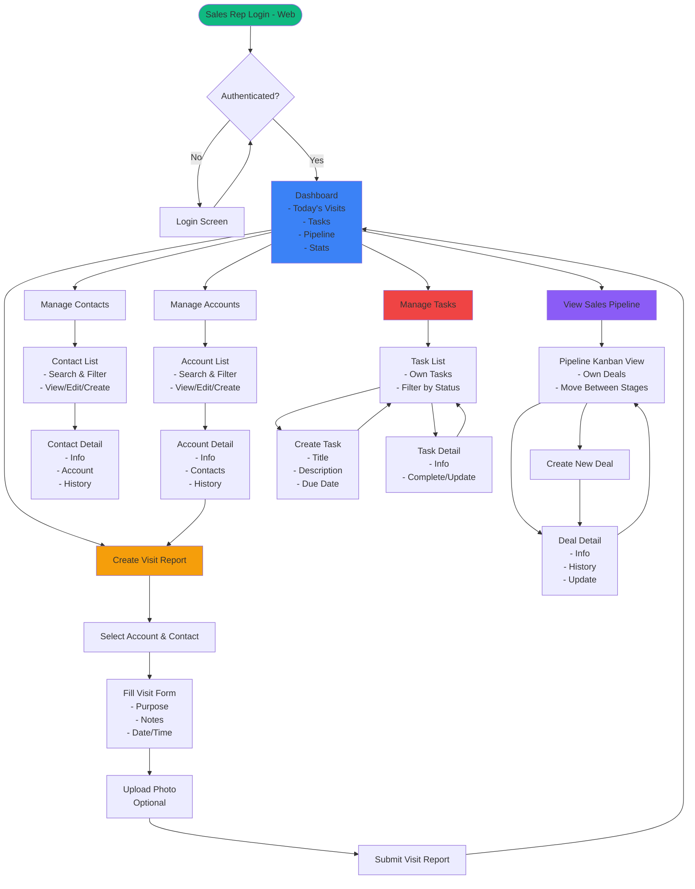

### 2. Sales Rep User Flow (Mobile)

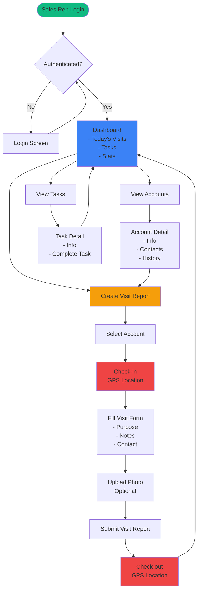

### 3. Supervisor User Flow (Web)

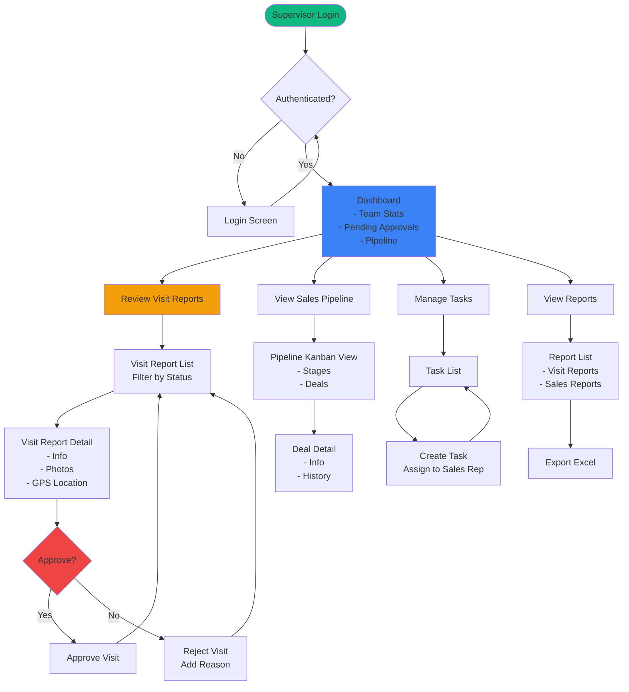

### 4. Admin User Flow (Web)

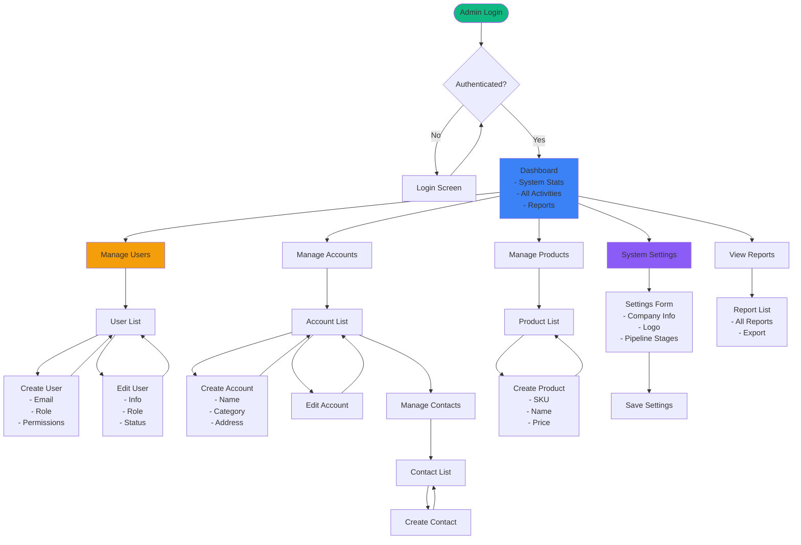

---

## Input/Output Diagrams

### 1. Account & Contact Management - I/O

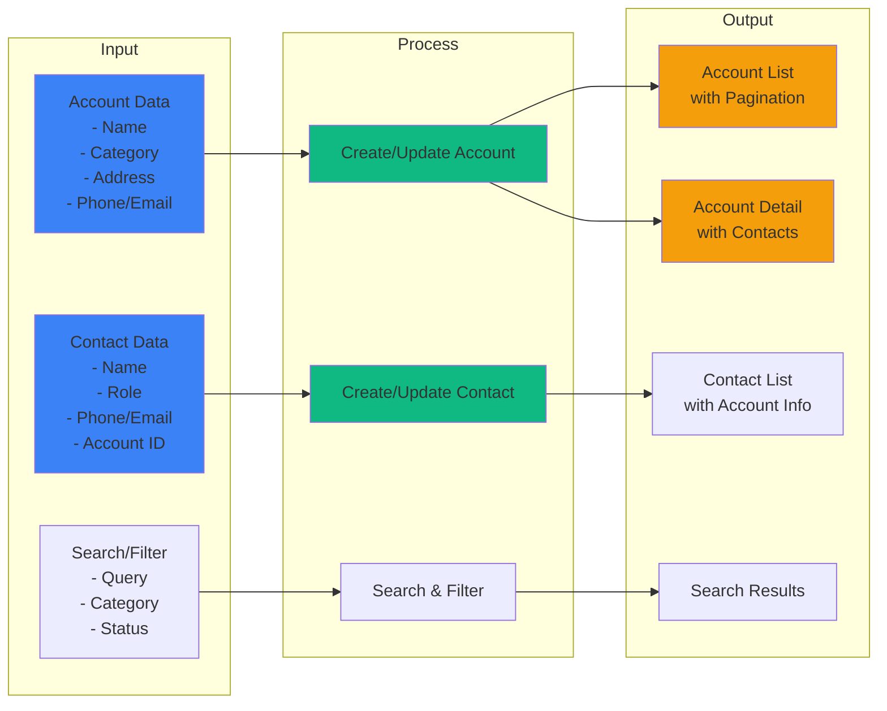

### 2. Visit Report - I/O

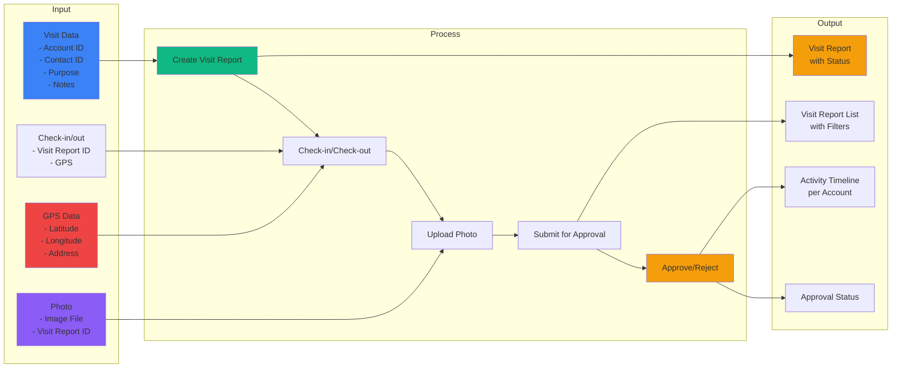

### 3. Sales Pipeline - I/O

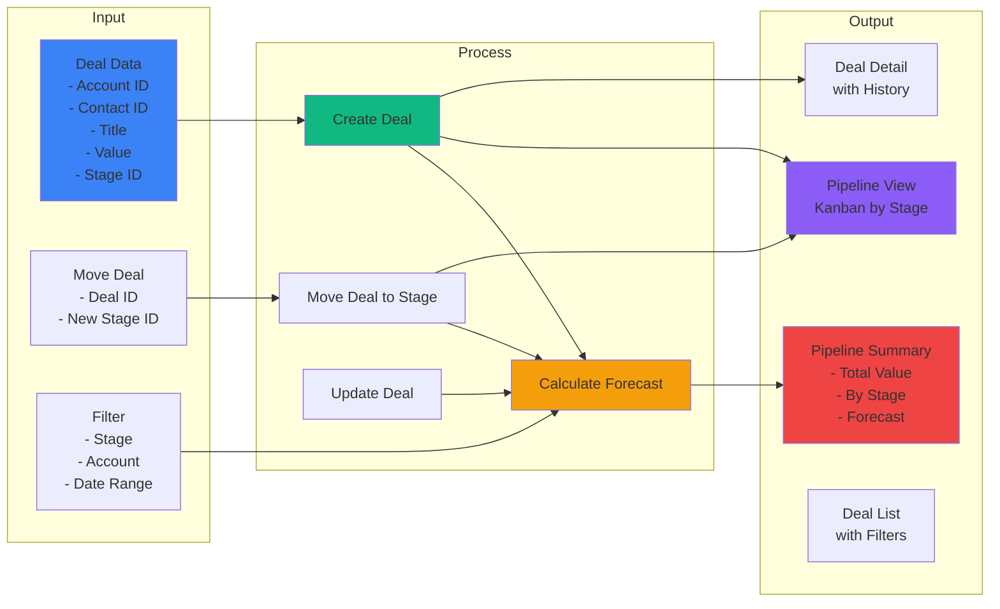

### 4. Task & Reminder - I/O

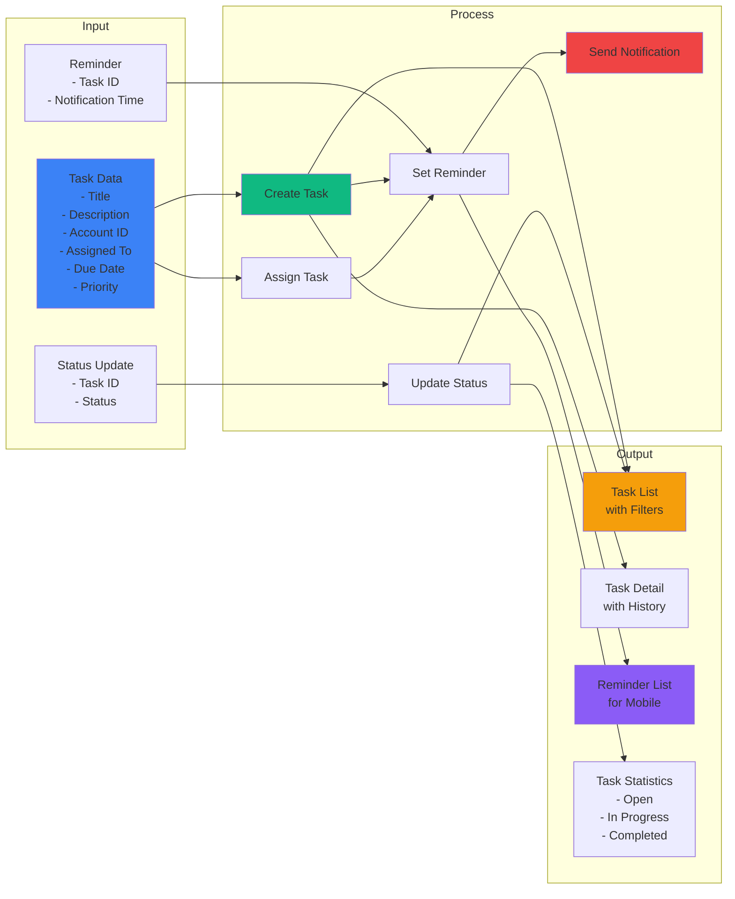

### 5. Dashboard - I/O

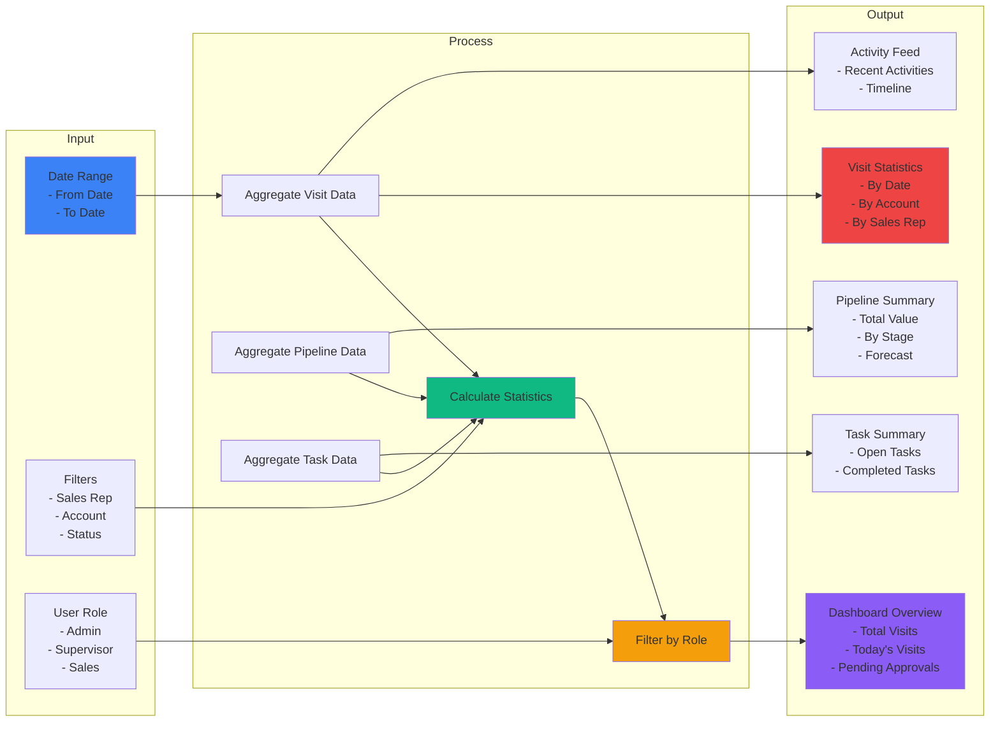

---

## System Architecture Diagram

### High-Level Architecture

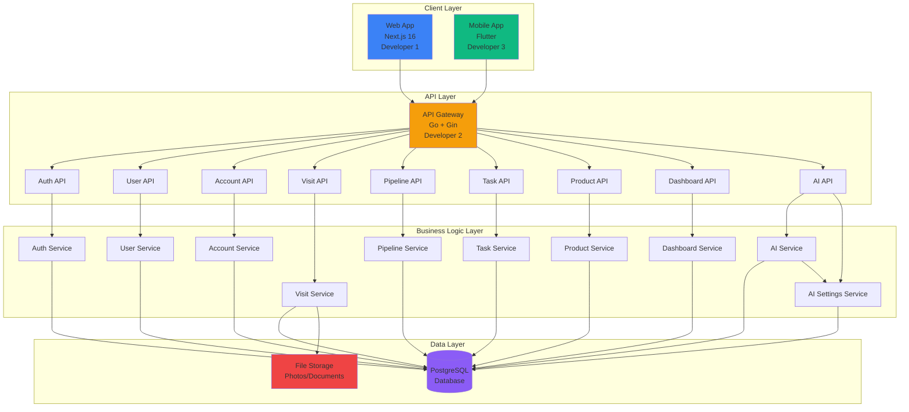

### Data Flow Diagram

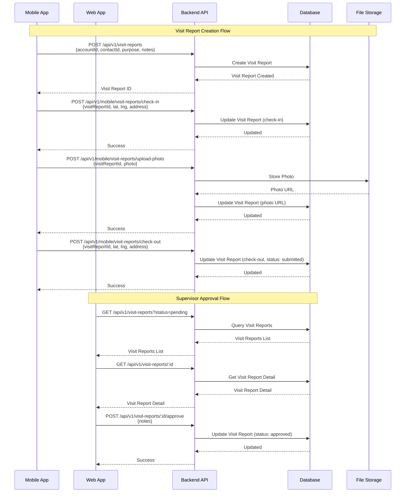

---

## Developer Responsibilities Matrix

### Developer 1: Web Developer

**Responsibilities:**
- ✅ Web UI/UX Development (Next.js 16)
- ✅ Frontend State Management (Zustand)
- ✅ Component Development (shadcn/ui v4)
- ✅ Integration with Backend APIs
- ✅ Form Validation (React Hook Form + Zod)
- ✅ Responsive Design (Tailwind CSS v4)

**Key Features:**
- **For All Roles:**
  - Account & Contact Management UI (CRUD)
  - Visit Report Creation & Management UI
  - Task Management UI
  - Dashboard UI
- **For Admin:**
  - User Management UI
  - System Settings UI
  - Full Reports UI
- **For Supervisor:**
  - Visit Report Review & Approval UI
  - Sales Pipeline Management UI
  - Team Reports UI
- **For Sales Rep:**
  - Visit Report Creation UI
  - Sales Pipeline View (Own Deals)
  - Own Reports View
  - AI Chatbot UI
  - AI Settings UI

### Developer 2: Backend Developer

**Responsibilities:**
- ✅ Backend API Development (Go + Gin)
- ✅ Database Design & Migration
- ✅ Business Logic Implementation
- ✅ Authentication & Authorization
- ✅ File Upload Handling
- ✅ API Documentation (Postman)

**Key Features:**
- All REST APIs
- Database Models & Migrations
- Authentication Service
- File Storage Service
- AI Service (Cerebras/OpenAI/Anthropic)
- AI Settings & Privacy Management
- Data Validation
- Error Handling

### Developer 3: Mobile Developer

**Responsibilities:**
- ✅ Flutter Mobile App Development
- ✅ Mobile UI/UX
- ✅ GPS Integration
- ✅ Camera Integration
- ✅ Push Notifications
- ✅ Offline Support (Future)

**Key Features:**
- Account & Contact View
- Visit Report Creation with GPS & Camera
- Task Management
- Dashboard (Basic)
- Check-in/Check-out
- Photo Upload
- AI Chatbot (Future - if backend supports)

---

## Feature Priority Matrix

### MVP (Must Have)

| Feature | Priority | Developer 1 | Developer 2 | Developer 3 |
|---------|----------|-------------|-------------|-------------|
| Authentication | 🔴 High | ✅ | ✅ | ✅ |
| Account & Contact Management | 🔴 High | ✅ | ✅ | ✅ |
| Visit Report (Create) | 🔴 High | ✅ | ✅ | ✅ |
| Visit Report (Approve) | 🔴 High | ✅ | ✅ | ❌ |
| Sales Pipeline | 🟡 Medium | ✅ | ✅ | ❌ |
| Task & Reminder | 🟡 Medium | ✅ | ✅ | ✅ |
| Dashboard | 🟡 Medium | ✅ | ✅ | ✅ |
| AI Assistant | 🟡 Medium | ✅ | ✅ | ❌ |
| Product Management | 🟢 Low | ✅ | ✅ | ❌ |

### Legend
- 🔴 High: Critical for MVP
- 🟡 Medium: Important but can be simplified
- 🟢 Low: Nice to have, can be deferred

---

## Summary

### Project Scope
- **Platform**: Web (Next.js 16) + Mobile (Flutter) + Backend (Go)
- **Users**: Sales Rep, Supervisor, Admin
- **Core Features**: 9 modules (Auth, Users, Accounts, Visits, Pipeline, Tasks, Products, Dashboard, AI Assistant)

### Key User Flows

1. **Sales Rep (Web)**: 
   - Login → Dashboard → Manage Accounts/Contacts → Create Visit Report → View Pipeline → Manage Tasks
   
2. **Sales Rep (Mobile)**: 
   - Login → Dashboard → Create Visit Report → Check-in (GPS) → Fill Form → Upload Photo → Check-out (GPS) → View Tasks
   
3. **Supervisor (Web)**: 
   - Login → Dashboard → Review Visit Reports → Approve/Reject → View Pipeline → Manage Tasks → View Reports
   
4. **Admin (Web)**: 
   - Login → Dashboard → Manage Users → Manage Accounts → Manage Products → System Settings → View All Reports

### Developer Focus
- **Developer 1**: Web UI/UX, Frontend Logic, Component Development
- **Developer 2**: Backend APIs, Database, Business Logic
- **Developer 3**: Mobile App, GPS/Camera Integration, Mobile UX

---

**Last Updated**: 2025-01-15  
**Maintained By**: Development Team

