# Project Diagrams - Ticketing Konser
## Ticketing Konser Internasional Platform

**Versi**: 1.0  
**Last Updated**: 2025-01-XX  
**Purpose**: Visualisasi scope, fitur, dan user flow untuk Developer 1 dan Developer 2

---

## 📋 Daftar Isi

1. [Project Scope Overview](#project-scope-overview)
2. [Feature Modules Diagram](#feature-modules-diagram)
3. [User Flow Diagrams](#user-flow-diagrams)
4. [Input/Output Diagrams](#inputoutput-diagrams)
5. [System Architecture Diagram](#system-architecture-diagram)

---

## Project Scope Overview

### Platform & Technology Stack

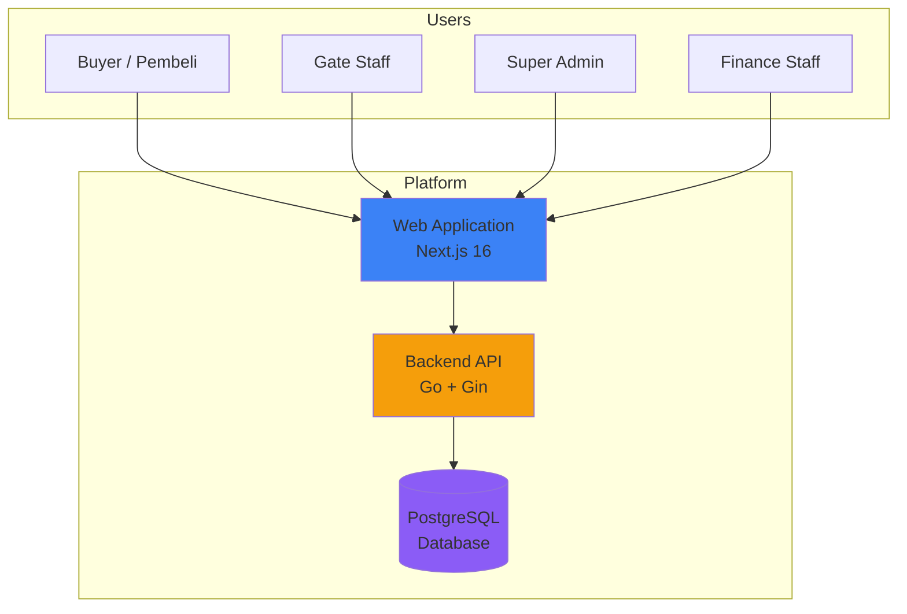

### Core Modules Overview

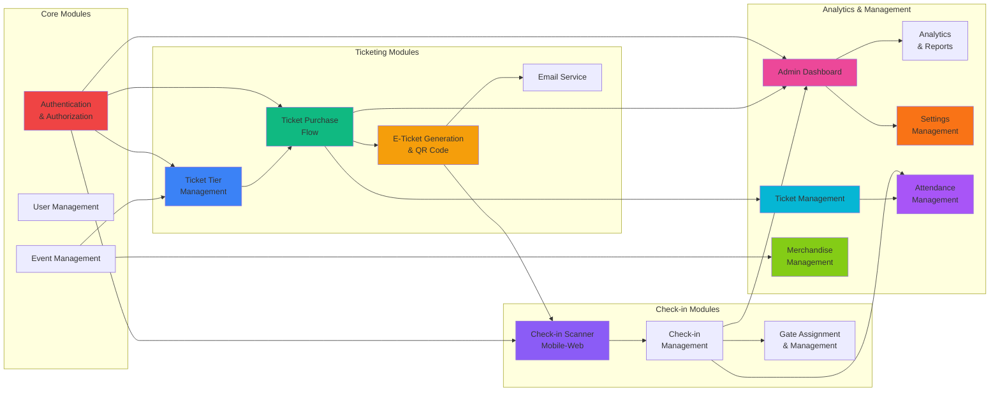

---

## Feature Modules Diagram

### Module Features & Capabilities

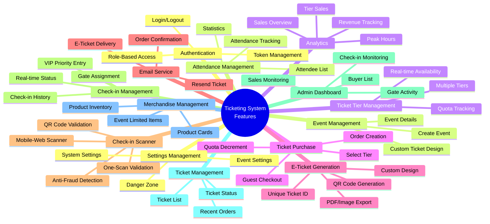

### Feature Matrix by Role

| Feature | Buyer | Gate Staff | Finance | Super Admin | Backend API |
|---------|-------|------------|---------|-------------|-------------|
| **Authentication** | ❌ (Guest) | ✅ Full | ✅ Full | ✅ Full | ✅ Full |
| **Event View** | ✅ View | ✅ View | ✅ View | ✅ Full (CRUD) | ✅ Full |
| **Ticket Purchase** | ✅ Full | ❌ | ❌ | ❌ | ✅ Full |
| **E-Ticket View** | ✅ Own Tickets | ❌ | ❌ | ✅ All Tickets | ✅ Full |
| **Check-in Scanner** | ❌ | ✅ Full | ❌ | ✅ Full | ✅ Full |
| **Check-in Status** | ❌ | ✅ View | ✅ View | ✅ Full | ✅ Full |
| **Gate Management** | ❌ | ❌ | ❌ | ✅ Full | ✅ Full |
| **Sales Monitoring** | ❌ | ❌ | ✅ View | ✅ Full | ✅ Full |
| **Analytics** | ❌ | ❌ | ✅ View | ✅ Full | ✅ Full |
| **Buyer List** | ❌ | ❌ | ✅ Export | ✅ Full | ✅ Full |
| **Ticket Management** | ❌ | ❌ | ✅ View | ✅ Full | ✅ Full |
| **Merchandise Management** | ❌ | ❌ | ❌ | ✅ Full | ✅ Full |
| **Settings Management** | ❌ | ❌ | ❌ | ✅ Full | ✅ Full |
| **Attendance Management** | ❌ | ✅ View | ✅ View | ✅ Full | ✅ Full |
| **User Management** | ❌ | ❌ | ❌ | ✅ Full | ✅ Full |

---

## User Flow Diagrams

### 1. Buyer User Flow (Ticket Purchase)

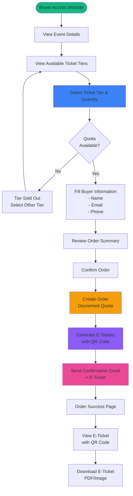

### 2. Gate Staff User Flow (Check-in)

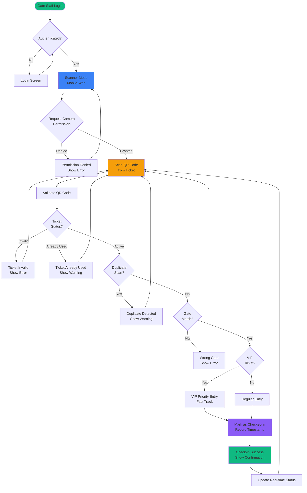

### 3. Super Admin User Flow

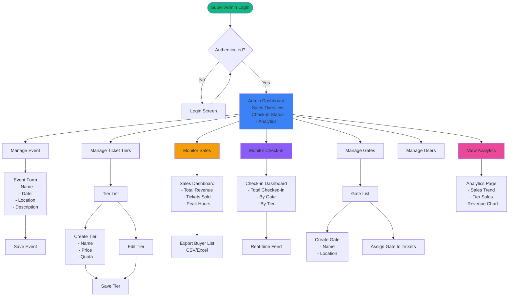

---

## Input/Output Diagrams

### 1. Ticket Purchase Flow

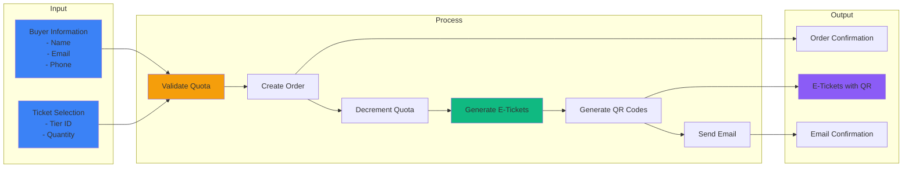

### 2. Check-in Flow

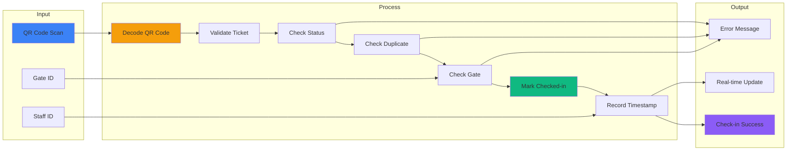

### 3. Analytics Flow

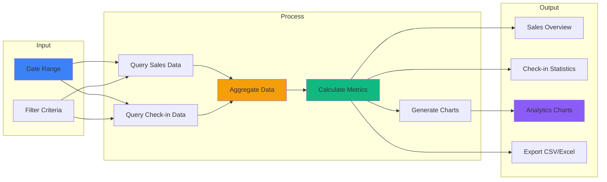

---

## System Architecture Diagram

### High-Level Architecture

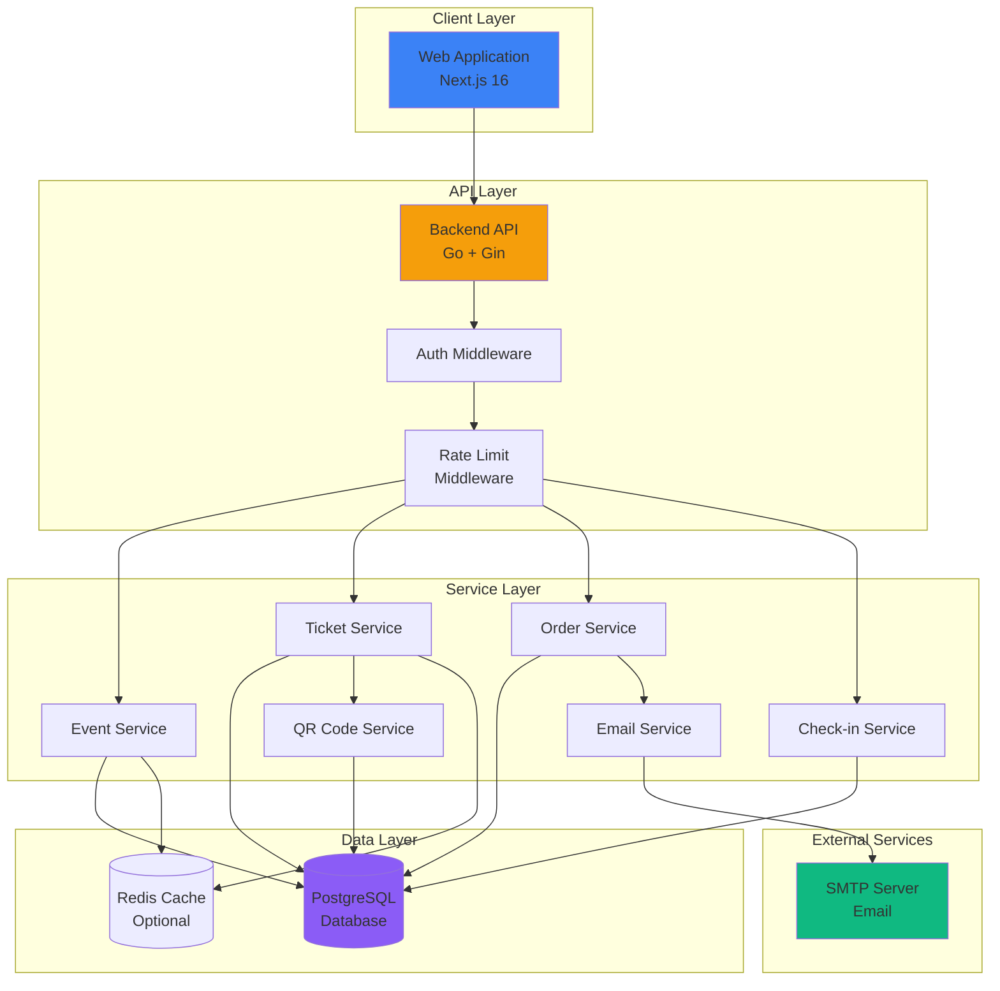

### Database Schema Overview

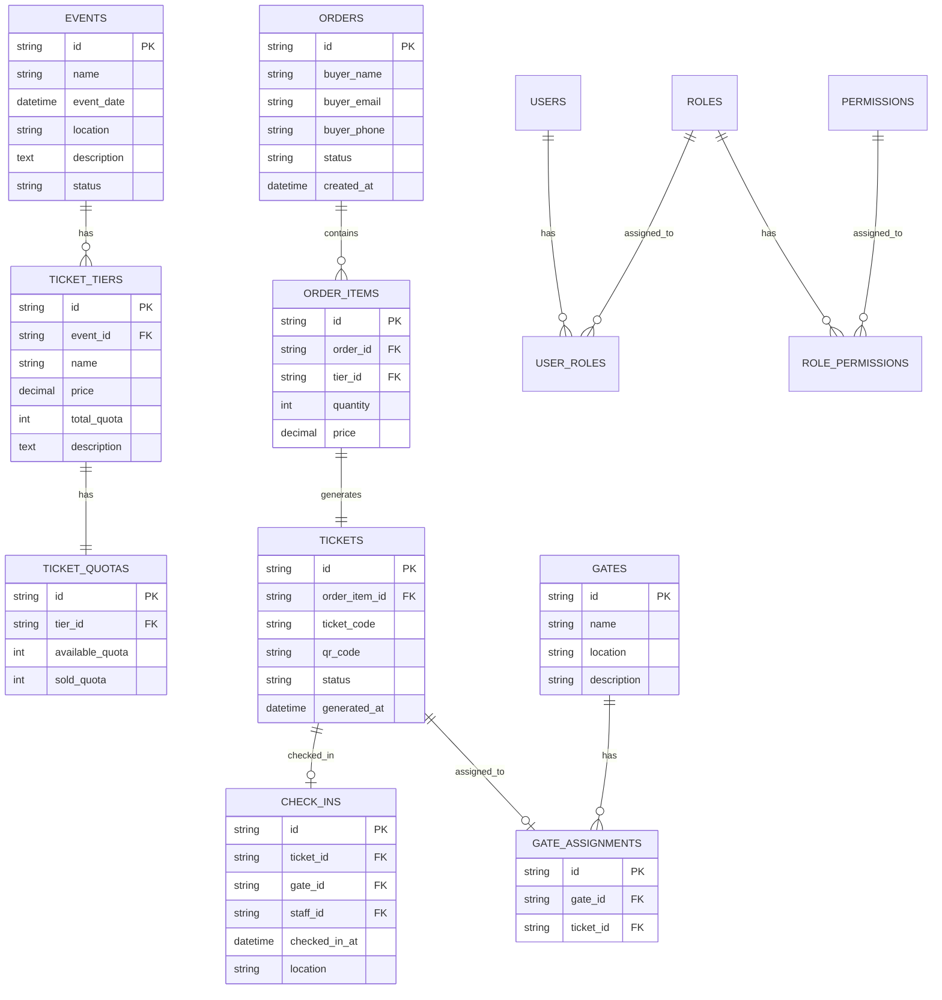

---

## Data Flow Diagrams

### 1. Ticket Purchase Data Flow

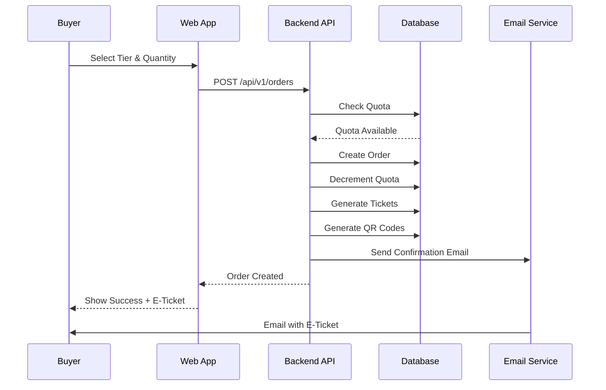

### 2. Check-in Data Flow

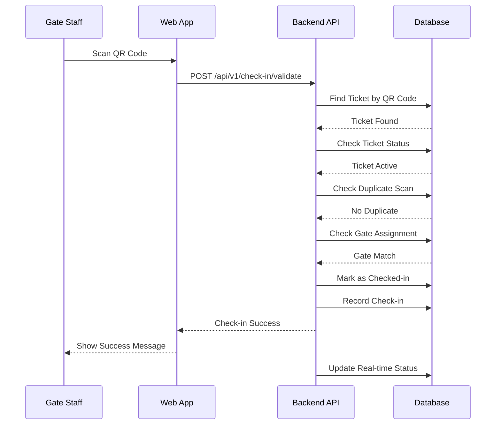

---

**Dokumen ini akan diupdate sesuai dengan perkembangan development.**

